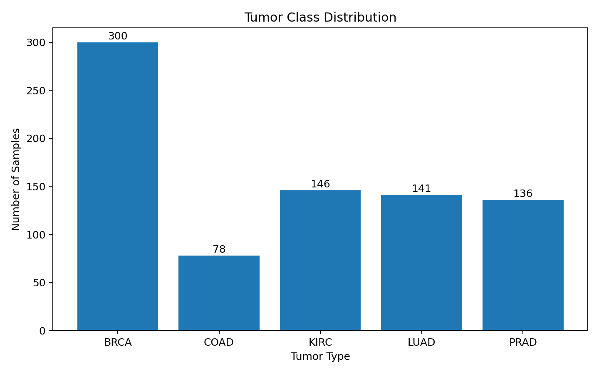
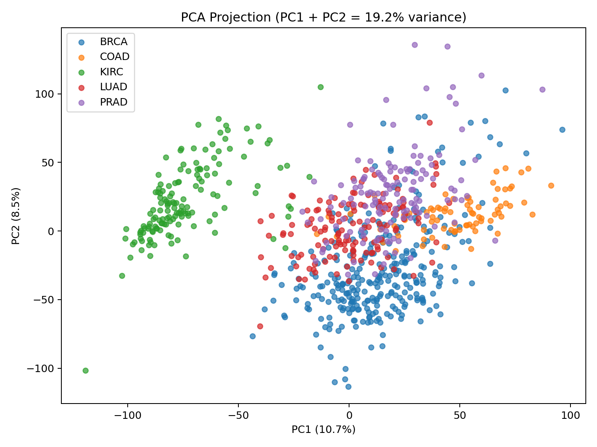
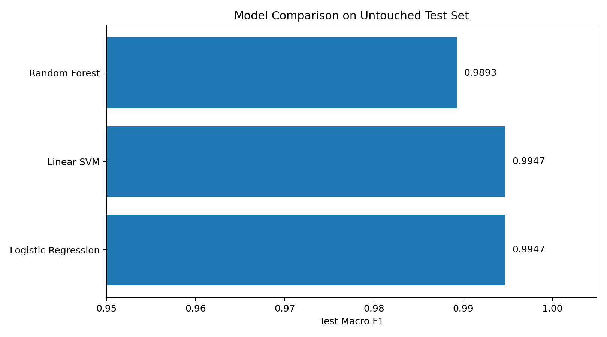
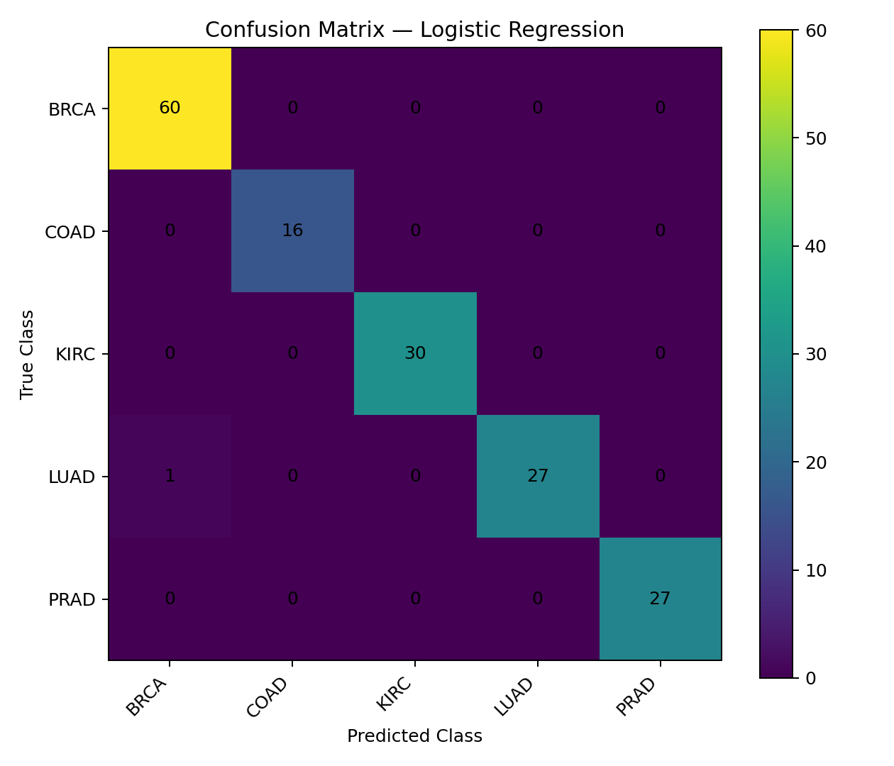
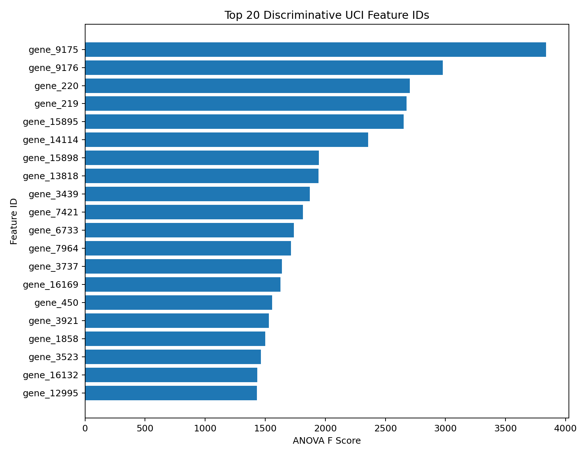
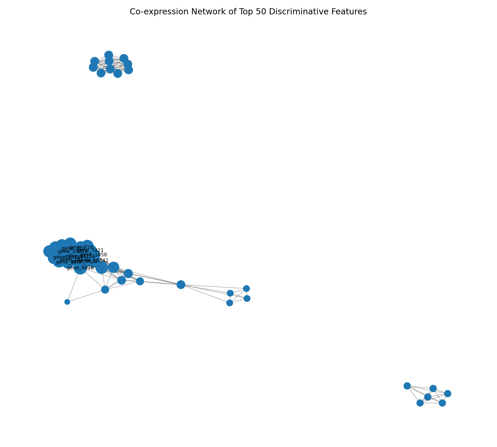
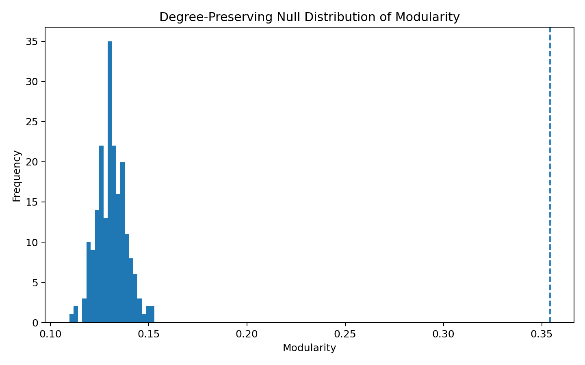

# RNA-Seq Tumor Type Classification

**Leakage-Free Feature Selection and Machine Learning for High-Dimensional Gene Expression Data**

This project classifies five tumor types from RNA-Seq expression profiles while
addressing a central statistical challenge: the number of predictors is much
larger than the number of samples.

The workflow compares **regularized logistic regression, linear SVM, and random
forest**, with variance filtering and feature selection performed inside the
training process to prevent information leakage.

## Dataset

The project is based on the UCI **Gene Expression Cancer RNA-Seq** dataset
(dataset ID 401; DOI `10.24432/C5R88H`).

Official UCI characteristics:

- **801 samples**
- **20,531 RNA-Seq expression features**
- **5 tumor classes:** BRCA, COAD, KIRC, LUAD, PRAD
- Dataset license: **CC BY 4.0**

### Important data-integrity note

The local CSV supplied during this refactoring contains **16,383 features**,
which is **4,148 fewer** than the official UCI dataset. The exact column count
is consistent with a file that may have been truncated during spreadsheet
handling.

Therefore, the numerical outputs committed here are clearly labeled
**development/reproduction results**. Regenerate the final public results from
the official dataset with:

```bash
python -m src.run_analysis --source uci
```

## High-Dimensional Setting

For the official dataset:

```text
n = 801 samples
p = 20,531 predictors
```

The feature dimension is more than 25 times the sample size.

## Methodology

1. Audit missing values, duplicates, constant predictors, and class balance.
2. Reserve a **stratified 20% holdout test set**.
3. Keep variance filtering, feature selection, scaling, and tuning inside the
   training workflow.
4. Use **5-fold stratified cross-validation** on the training set.
5. Compare logistic regression, linear SVM, and random forest.
6. Evaluate the selected models once on the untouched test set.
7. Report accuracy, macro F1, weighted F1, per-class performance, and ROC-AUC.
8. Rank discriminative UCI feature IDs using training-derived ANOVA F scores.
9. Explore correlations among the highest-ranked features using a
   **co-expression network**.

## Development Results on the Supplied Local Copy

| Model | Best CV Macro F1 | Test Accuracy | Test Macro F1 | Test ROC-AUC |
|---|---:|---:|---:|---:|
| Logistic Regression | 1.0000 | 0.9938 | 0.9947 | 1.0000 |
| Linear SVM | 0.9987 | 0.9938 | 0.9947 | 1.0000 |
| Random Forest | 0.9961 | 0.9876 | 0.9893 | 1.0000 |

The logistic-regression pipeline selected **250 features** with `C = 0.1`.
It correctly classified **160 of 161** holdout samples. The single observed
error was one LUAD sample classified as BRCA.

> These values validate the improved workflow on the supplied local copy and
> should be rerun on the complete official dataset before being presented as
> definitive benchmark results.

## Class Distribution



## PCA Visualization

The first two standardized components explain approximately **19.2%** of the
variance in the supplied local copy.



## Model Comparison



## Confusion Matrix



## Discriminative Feature IDs



The UCI dataset uses anonymous identifiers such as `gene_9175`. These are
**feature IDs, not biological gene names**. They should not be described as
validated biomarkers until mapped to the original TCGA annotations and
independently validated.

## Exploratory Co-expression Network

Among the top 50 discriminative training-set features, an edge is drawn when
the absolute Pearson correlation is at least 0.70.

Current development network:

- **50 nodes**
- **358 edges**
- **5 communities**
- Modularity: **0.354**
- Degree-preserving randomization p-value: **0.0050**





This is a **statistical co-expression network**, not evidence of direct
biological interaction, regulation, or causality.

## Repository Structure

```text
rna-seq-tumor-classification/
├── README.md
├── requirements.txt
├── LICENSE
├── .gitignore
├── data/
│   └── README.md
├── notebooks/
│   └── README.md
├── results/
│   ├── model_comparison.csv
│   ├── classification_report_logistic.csv
│   ├── confusion_matrix_logistic.csv
│   ├── top_20_anova_features.csv
│   ├── class_distribution.png
│   ├── pca_projection.png
│   ├── model_comparison.png
│   ├── confusion_matrix_logistic.png
│   ├── top_features.png
│   ├── coexpression_network.png
│   ├── modularity_permutation_test.png
│   └── coexpression_network.graphml
├── src/
│   ├── __init__.py
│   ├── data.py
│   ├── modeling.py
│   ├── network.py
│   └── run_analysis.py
└── tests/
    ├── test_data.py
    └── test_network.py
```

## Installation

```bash
pip install -r requirements.txt
```

## Reproduce Using the Official UCI Dataset

```bash
python -m src.run_analysis --source uci
```

## Dataset Citation

Fiorini, S. (2016). *gene expression cancer RNA-Seq* [Dataset].
UCI Machine Learning Repository. DOI: `10.24432/C5R88H`.

## Intended Use

This repository is an educational and research demonstration of
high-dimensional classification. It is **not a clinical diagnostic system**,
and its feature rankings are not clinically validated biomarkers.

## Author

Dr. Emil Agbemade
